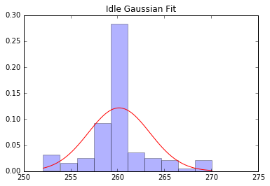
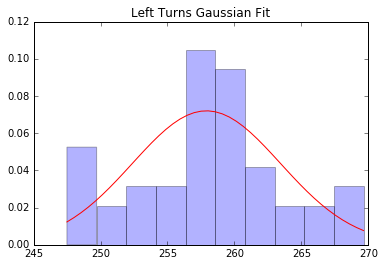
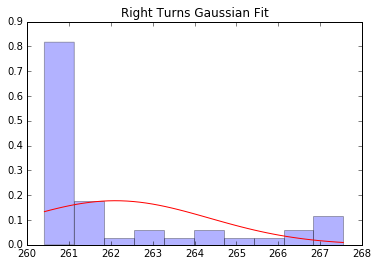
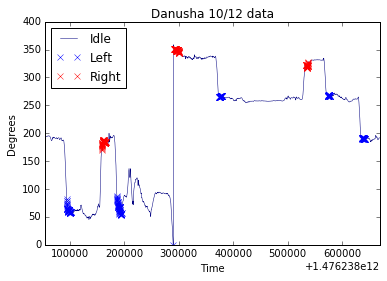
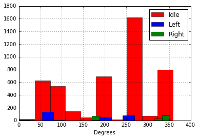

```python
import pandas as pd
import numpy as np
import matplotlib.mlab as mlab
import matplotlib.pyplot as plt
from scipy import stats  
import numpy as np  
%matplotlib inline

df = pd.DataFrame.from_csv('124909.csv', parse_dates=False)
# print df

dfIdle = df[(df['TurnReal'] == 'IDLE')]
dfLeft = df[(df['TurnReal'] == 'LEFT')]
dfRight = df[(df['TurnReal']) == 'RIGHT']

# print df

series = df.Degrees.plot(colormap='jet', lw=0.5, title='Car Maneuver Degrees Time Series')
# dfIdle.Degrees.plot(color='y', lw=0.5)
dfLeft.Degrees.plot(color='r', lw=0.5)
dfRight.Degrees.plot(color='g', lw=0.5)

maneuvers = ['All', 'Left', 'Right']
series.legend(maneuvers, loc='best')
series.set_ylabel("Degrees")
```


    <matplotlib.text.Text at 0x125929e8>


```python
# df.Degrees.hist(color='r',lw=0.5)
hist = dfIdle.Degrees.hist(color='r', lw=0.5)
dfLeft.Degrees.hist(color='b', lw=0.5)
dfRight.Degrees.hist(color = 'g', lw=0.5)

maneuvers = ['Idle', 'Left', 'Right']
hist.legend(maneuvers, loc='best')
hist.set_xlabel("Degrees")

# Extract degree means for each maneuver class
print("Idle Mean: ", dfIdle.Degrees.mean())
print("Left Mean: ", dfLeft.Degrees.mean())
print("Right Mean: ", dfRight.Degrees.mean())

```

    ('Idle Mean: ', 260.17193074074083)
    ('Left Mean: ', 257.9068883720929)
    ('Right Mean: ', 262.1041210416667)
    


```python
def plotFitOverHist(df, t):
    tmin, tmax = min(df), max(df)
    space = np.linspace(tmin, tmax, len(df))
    m = df.mean()
    s = df.std()
    pdf = stats.norm.pdf(space, m, s)
    plt.hist(df, normed = True, alpha=.3)
    plt.plot(space, pdf, label="Norm", color='r')
    plt.title(t)
    plt.show()

plotFitOverHist(dfIdle.Degrees, 'Idle Gaussian Fit')
plotFitOverHist(dfLeft.Degrees, 'Left Turns Gaussian Fit')
plotFitOverHist(dfRight.Degrees, 'Right Turns Gaussian Fit')
```











```python
slopes = pd.DataFrame.from_csv('danusha.csv', parse_dates=False)
slopesIdle = slopes[(slopes['Turn'] == '-9999')]
slopesLeft = slopes[(slopes['Turn'] == 'LEFT')]
slopesRight = slopes[(slopes['Turn'] == 'RIGHT')]

slopes_series = slopes.Degrees.plot(colormap='jet', lw=0.5, title='Danusha 10/12 data')
slopesLeft.Degrees.plot(style=['bx', 'rx'])
slopesRight.Degrees.plot(style=['rx', 'rx'])

slopes_series.legend(maneuvers, loc='best')
slopes_series.set_ylabel("Degrees")
```


    <matplotlib.text.Text at 0x10d62518>





```python
hist = slopesIdle.Degrees.hist(color='r', lw=0.5)
slopesLeft.Degrees.hist(color='b', lw=0.5)
slopesRight.Degrees.hist(color = 'g', lw=0.5)

maneuvers = ['Idle', 'Left', 'Right']
hist.legend(maneuvers, loc='best')
hist.set_xlabel("Degrees")

# Extract degree means for each maneuver class
print("Idle Mean: ", slopesIdle.Degrees.mean())
print("Left Mean: ", slopesLeft.Degrees.mean())
print("Right Mean: ", slopesRight.Degrees.mean())
```

    ('Idle Mean: ', 209.74138175820156)
    ('Left Mean: ', 144.09827117670423)
    ('Right Mean: ', 280.9025198324023)
    




