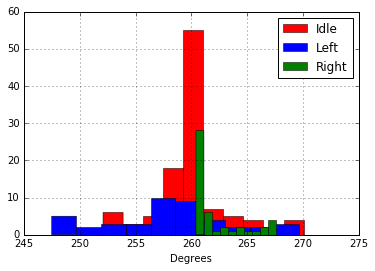

```python
import pandas as pd
%matplotlib inline


df = pd.DataFrame.from_csv('124909.csv', parse_dates=False)
# print df

dfIdle = df[(df['TurnReal'] == 'IDLE')]
dfLeft = df[(df['TurnReal'] == 'LEFT')]
dfRight = df[(df['TurnReal']) == 'RIGHT']

# print dfLeft

# df.Degrees.hist(color='r',lw=0.5)
# dfLeft.Degrees.hist(color='b', lw=0.5)
# dfRight.Degrees.hist(color = 'g', lw=0.5)

df.Degrees.plot(color='r', lw=0.5)
# dfIdle.Degrees.plot(color='y', lw=0.5)
dfLeft.Degrees.plot(color='b', lw=0.5)
dfRight.Degrees.plot(color='g', lw=0.5)
```


    <matplotlib.axes._subplots.AxesSubplot at 0xdad4e80>


```python
# df.Degrees.hist(color='r',lw=0.5)
dfIdle.Degrees.hist(color='r', lw=0.5)
dfLeft.Degrees.hist(color='b', lw=0.5)
dfRight.Degrees.hist(color = 'g', lw=0.5)

print("Idle Mean: ", dfIdle.Degrees.mean())
print("Left Mean: ", dfLeft.Degrees.mean())
print("Right Mean: ", dfRight.Degrees.mean())
```

    ('Idle Mean: ', 260.17193074074083)
    ('Left Mean: ', 257.9068883720929)
    ('Right Mean: ', 262.1041210416667)
    





```python

```
